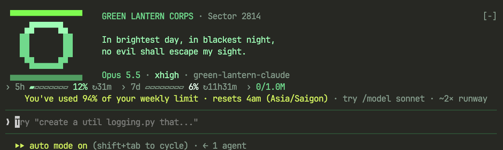
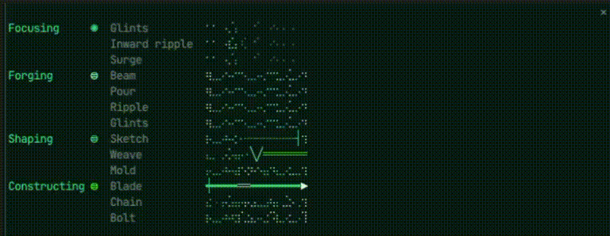
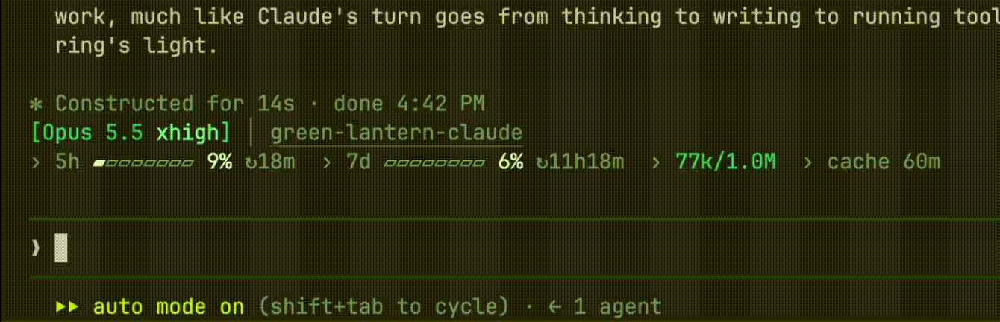
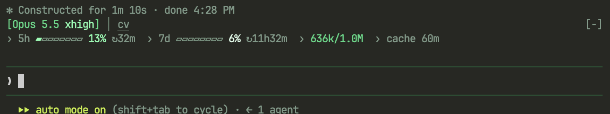

# Green Lantern for Claude Code

> *In brightest day, in blackest night, no evil shall escape my sight.*

A Green Lantern UI for [Claude Code](https://claude.com/claude-code), packaged as a plugin. Claude's spinner becomes a power ring, your usage limits become the ring's charge, and the theme goes emerald throughout.



## Updates

### 0.3.2: Shaping gets its own power

- **Shaping has its own acts.** While Claude writes out a tool call (the command, or the code for an edit), the mode you see most in a coding session, the pool stirs and each prompt rolls a pen sketching outlines `◇┄┄╢`, strands woven into a cable `╳─╳─`, or the pool molded into a block, a dome or steps. Shaping sketches the construct; Constructing forges it.
- **A roomier demo.** `/lantern-demo` adds the Shaping rows and leaves a blank row between every two, so the rows of light no longer touch.

### 0.3.1: `/lantern-demo`

- **See every act on demand.** Since each prompt rolls its act at random, `/lantern-demo` opens a pane that plays them all at once, each on its own row. See [Demo](#demo).

### 0.3.0: the power moves to the badge, and every prompt rolls its act

<!-- GIF placeholder. Record one turn in 0.3.0 (Focusing → Forging → Constructing), save it as assets/power-badge.gif,
     then replace this comment with:

-->

- **The power rides the badge row.** While Claude works, the power flows out of the HUD's badge, two cells after your project name, instead of sitting at the far end of the spinner row. It's in the same place at every terminal width. The ring stays on the spinner glyph.
- **Every prompt rolls an act.** Each mode keeps a base light running, and every prompt picks one act per mode at random, which then plays for the whole prompt:
  - Thinking: glints `· ✧ ✦`, inward ripples, or a surge of motes.
  - Writing: beams `┄─━━◆`, arcs of light poured out, ripples, or glints.
  - Using a tool: a hard-light blade `┿━━━━▶` forged and shattered, a chain forged link by link, or lightning `╱╲╱╲ϟ`.
- **Hard-light glyphs.** The acts mix box-drawing strokes and stars with the braille dots. Every one is single-width, so nothing in Claude Code's rows shifts.
- **A pool, not a meter.** Writing and tools draw the light as a bright surface over a twinkling body, instead of filled columns that read like a volume meter.
- **Twice the width.** The power is 16 cells wide (32×4 dots), up from 8.
- **Same cost.** The animation still runs only while Claude works, on the same 110 ms frame clock.

## Demo

Each prompt rolls its act at random, so any one act is hard to catch on screen. To see them all, type in Claude Code:

```
/lantern-demo
```

A pane opens with every act the ring can roll, each on its own row under its mode (*Focusing*, *Forging*, *Shaping*, *Constructing*) with a blank row between, and playing on a loop. Every act comes round within about 7 seconds. It draws with the plugin's real ring and power, in your own terminal, so it's also the easiest way to record them. Run `/lantern-demo` again to close it; the animations stop with the pane.

<!-- GIF placeholder. Run /lantern-demo, record about 7 seconds of the pane, save it as assets/lantern-demo.gif,
     then replace this comment with:

-->

## What you get

**Ring-power spinner.** The ring takes the place of the spinner glyph. Its power rides the HUD band below, beside your project name, flowing out of the badge into the free row while Claude works. Each mode keeps a base light running, and every prompt rolls one act per mode at random, which then plays for the whole prompt:

| Claude is… | Ring | Power: base | Acts a prompt can roll |
|---|---|---|---|
| Sending the request | `◌ ○ ◎ ◉ ⊜`: charging | (none) | |
| Thinking | `◉`: breathing | Motes of will drifting in toward the badge | Glints `· ✧ ✦`, inward ripples, a surge of motes |
| Writing | `⊜` | A pool of light sloshing, sparks popping off the crests | Beams `┄─━━◆`, arcs of light poured out, ripples, glints |
| Writing a tool call | `⊜` pulsing | The pool stirring | A pen sketching outlines `◇┄┄╢`, strands woven into a cable `╳─╳─`, or the pool molded into a block, a dome or steps |
| Using a tool | `⊜` flickering white-hot | The pool boiling | A blade `┿━━━━▶` forged and shattered, a chain forged link by link, lightning `╱╲╱╲ϟ` |



The spinner words follow the same modes: *Charging, Focusing, Forging, Shaping, Constructing*. Nothing in Claude Code's own row moves: the timer, token count and tips stay where they are.

**Battery-style usage bars.** The 5-hour and 7-day limits show the charge *left*, full when unused and draining as you work. They pale from lantern green, to glow at 25% left, to almost white at 10%.



**A fresh-session emblem.** A new session (or one just `/clear`ed) opens with the lantern emblem and the oath above the prompt, as pictured at the top. It folds away into the everyday HUD on your first prompt.

**Lantern turn words.** *Forged for 1m 12s*, *Charged for 9s*, …

**An emerald theme.** 57 of Claude Code's colors in layered greens: spinner, borders, permission prompts, diffs, the mascot. The ultrathink rainbow becomes the Emotional Spectrum of the seven Lantern Corps.

## Install

In Claude Code:

```
/plugin marketplace add vogiaan1904/green-lantern-claude
/plugin install green-lantern@green-lantern
```

Restart Claude Code, then choose the theme with `/theme`. A plugin can ship a theme but can't select it for you.

### Optional settings

In `~/.claude/settings.json`:

- **The oath as spinner tips:**
  ```json
  "spinnerTipsOverride": {
    "label": "⊜",
    "tips": [
      "In brightest day, in blackest night, no evil shall escape my sight.",
      "Let those who worship evil's might beware my power: Green Lantern's light!"
    ]
  }
  ```
- **A still ring**, if you prefer no animation: `"prefersReducedMotion": true`.

## Requirements and caveats

- **Claude Code with plugin mods (function hooks).** Tested on Claude Code 2.1.288. The mod API is early access and may change between releases. If something breaks after an upgrade, please open an issue.
- **Spinner layout.** The ring sits over Claude Code's own spinner glyph and relies on its current layout: the glyph in the first column of the verb row. The power needs 18 free columns after the project name in the badge row; a narrower band leaves it out.
- **Font.** Your terminal font needs braille characters (U+2800–U+28FF), box drawing (`━ ┄ ═ ╱ ╲`) and a few symbols (`⊜ ◆ ▶ ✦ ✧ ϟ`). All are single-width; most modern monospace fonts have them or fall back cleanly.
- **Surfaces.** The animations draw in the terminal and the desktop app. Elsewhere you get the still version.
- **Cost.** The animation only runs while Claude is working, on Claude Code's own frame clock. Idle cost is a 30-second timer.

## Development

```bash
claude --plugin-dir .            # run it from the checkout; this also lays the types tsc needs
claude plugin validate .
npx -y -p typescript@5 tsc -p .
claude plugin test .
python3 scripts/check-theme.py   # after each Claude Code upgrade: theme keys it doesn't know are dropped silently
```

| File | What it owns |
|---|---|
| `hooks/register.tsx` | The HUD band, battery bars, emblem, spinner hook, turn words |
| `hooks/ring.tsx` | The ring over the spinner glyph; it tells the band which mode it shows |
| `hooks/power.tsx` | The power beside the project: a 32×4 braille canvas plus glyphs, its base and the rolled act |
| `themes/green-lantern.json` | The color overrides (base `dark`) |
| `tests/green-lantern.test.tsx` | The behaviour, run by `claude plugin test` |

## License and disclaimer

MIT. This is a fan project, not affiliated with or endorsed by DC Comics or Warner Bros. Green Lantern and related names are trademarks of DC Comics.
