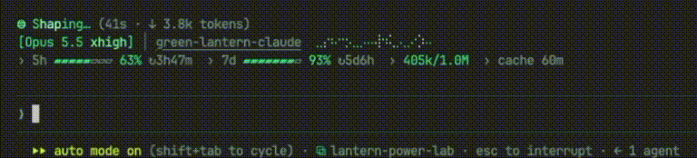

# Green Lantern for Claude Code

> *In brightest day, in blackest night, no evil shall escape my sight.*

A Green Lantern UI for [Claude Code](https://claude.com/claude-code), packaged as a plugin. Claude's spinner becomes a power ring, your usage limits become the ring's charge, and the theme goes emerald throughout.


## What you get

**A ring-power spinner.** The ring takes the place of the spinner glyph. While Claude works, its power flows out of the HUD's badge, beside your project name. Each mode has its own light, and every prompt rolls one act per mode at random:

| Claude is… | Spinner word | Ring | Power |
|---|---|---|---|
| Sending the request | Charging | `◌ ○ ◎ ◉ ⊜` | (none yet) |
| Thinking | Focusing | `◉` breathing | Motes drifting in, with glints, inward ripples or a surge |
| Writing | Forging | `⊜` | A pool of light, with beams, poured arcs, ripples or glints |
| Writing a tool call | Shaping | `⊜` pulsing | The pool stirring, with a sketched outline, a woven cable or a mold |
| Running a tool | Constructing | `⊜` white-hot | The pool boiling, with a forged blade, a chain or lightning |



**Battery-style usage bars.** The 5-hour and 7-day limits show the charge *left*, full when unused and draining as you work. They pale from lantern green to almost white as they run low.

**A fresh-session emblem.** A new session, or one just `/clear`ed, opens with the emblem and the oath, as pictured above. It folds away into the everyday HUD on your first prompt.

**Lantern turn words.** *Forged for 1m 12s*, *Charged for 9s*, …

**An emerald theme.** 57 of Claude Code's colors in layered greens, from the spinner and borders to diffs and the mascot.

To see every act at once, run `/lantern-demo`. A pane opens with each act on its own row, playing on a loop; run it again to close it.


## Install

In Claude Code:

```
/plugin marketplace add vogiaan1904/green-lantern-claude
/plugin install green-lantern@green-lantern
```

Restart Claude Code, then choose the theme with `/theme`. A plugin can ship a theme but can't select it for you.

Optional, in `~/.claude/settings.json`:

- **The oath as spinner tips:**
  ```json
  "spinnerTipsOverride": {
    "label": "⊜",
    "tips": [
      "In brightest day, in blackest night, no evil shall escape my sight.",
      "Let those who worship evil's might beware my power: Green Lantern's light!"
    ]
  }
  ```
- **A still ring**, if you prefer no animation: `"prefersReducedMotion": true`.

## Requirements

- **Claude Code with plugin mods (function hooks).** Tested on 2.1.289. The mod API is early access and may change between releases; if something breaks after an upgrade, please open an issue.
- **A font with braille, box drawing and a few symbols** (`⊜ ◆ ▶ ✦ ϟ`). Most modern monospace fonts have them.
- **The terminal or the desktop app.** Elsewhere you get the still version. The animation runs only while Claude works.

## Development

```bash
claude --plugin-dir .            # run it from the checkout; this also lays the types tsc needs
claude plugin validate .
npx -y -p typescript@5 tsc -p .
claude plugin test .
python3 scripts/check-theme.py   # after each Claude Code upgrade: theme keys it doesn't know are dropped silently
```

## License

MIT. This is a fan project, not affiliated with or endorsed by DC Comics or Warner Bros. Green Lantern and related names are trademarks of DC Comics.
